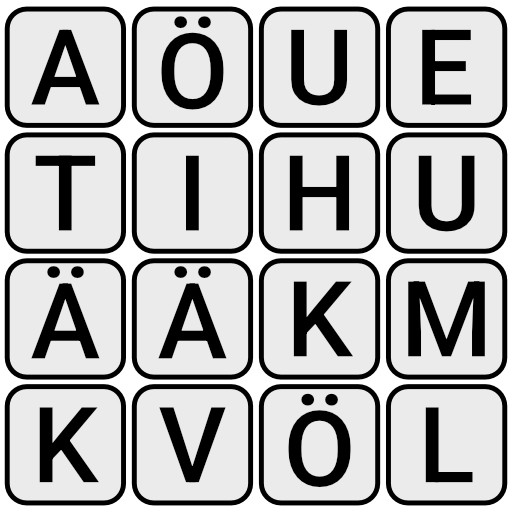
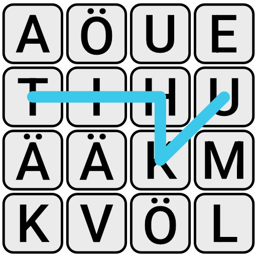
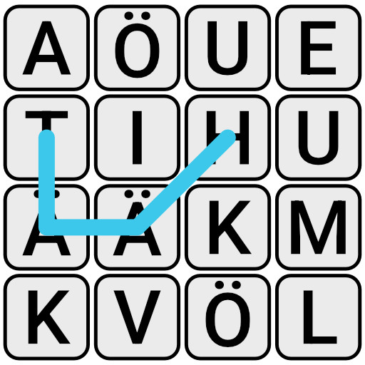

# Boggle
★★★★★

Kun sinulla on nyt [sanakirja-tehtävän](sanakirja.md) sanakirjapuu tehtynä, niin sille olisi hyvä keksiä jotain käyttöä. Onneksi ihmiset ovat laiskoja, ja kaikista parasta hupia on pelien pelaamisen automatisoida tietokoneille. Enää ei tarvitse itse miettiä ja olla hyvä peleissä, kun tietokoneet osaavat senkin hoitaa.

Yritetään siis ratkaista [Boggle-pelin](https://fi.wikipedia.org/wiki/Boggle) lauta automaattisesti. (*Vastaava peli on saatavilla myös muilla tuotenimillä.*) Pelin säännöt ovat seuraavat:

 - Pelissä on ruudukko kirjaimia, joista on tarkoitus etsiä sanoja.
 - Sanan peräkkäiset kirjaimet pitää olla ruudukossa vierekkäin, joko pääilmansuuntiin tai viistoittain.
 - Samaa kirjainlaattaa ei saa käyttää samassa sanassa kahdesti.
 - Pelissä on myös pisteytyssääntöjä, mutta ne eivät nyt kiinnosta.

Eli esimerkiksi, jos laudalle on arvottu seuraavanlaisesta kirjainruudukosta voi löytää muun muassa sanat `tihku`, `häät`, `hätä`, `ehkä`, `väki` ja `muki`.:



Sanojen sisäinen polku voi mennä kulkea ruudukossa hyvin vapaasti, kunhan peräkkäiset kirjaimet ovat laudalla vierekkäin.

{ .half-width }
{ .half-width }

Tee algoritmi, joka hakee ruudukosta kaikki mahdolliset sanat, jotka löytyvät käytetystä sanakirjasta. Tehtävän voi toki suorittaa monella eri tavalla, mutta helpointa olisi käyttää [sanakirja-tehtävässä](./sanakirja.md) rakennettua puurakennetta.

Tehtävä antaa syötteenä yhden 6x6 kokoisen kirjaintaulukon, jossa jokainen kirjainlaatta on merkitty omalla kirjaimellaan. Syötteessä jokainen ristikon vaakarivi on omalla tekstirivillään, ja pystyrivit on eroteltu rivinvaihdoilla. Esimerkiksi ylhäällä olevan kuvan ruudukko olisi merkitty näin:

```
aöue
tihu
ääkm
kvöl
```

Vastaukseksi odotetaan jokainen ruudukosta löytynyt sana, joka löytyy [sanakirja-tehtävän syötesanastosta](../syotteet/sanakirja_input.txt). Jokaisen sanan kuuluisi olla omalla rivillään, jolloin täydellinen vastaus tähän esimerkkiruudukkoon olisi seuraava:

```
ai
aihe
häätö
ikä
täh
```

Huomaa, että hyväksytty sanalista ei ole täydellinen lista kaikista sopivista suomenkielen sanoista, koska tehtävänannon käyttämä sanalista ei ole täydellinen. Käytetyssä sanalistassa on vain 5000 satunnaisesti valittua suomen sanaa.

??? abstract "Kaikki esimerkin sanat, jos käytetään koko kielitoimiston sanalistaa"
    ai, aihe, ehiö, ehkä, eu, he, hi, hiue, hm, hui, huit, huki, hä, häkä, hätä, häät, häätö, ihku, ikä, ikävä, it, itä, itää, iätä, kihu, kita, kuu, käki, käkö, kääk, muhia, muki, muu, mökä, tai, tihku, tihu, tiu, tä, täh, tähkiä, tähkiö, täi, tää, töhkä, uhku, uuhi, väki, väkä, äh, ähkiä, äklö, ääk


## Data

Lataa alla oleva tiedosto. Siinä on tehtävässä käytettävä 6x6 kirjaintaulukko. 

[Lataa syötetiedosto](../syotteet/boggle_input.txt){ .md-button }

Tehtävä olettaa, että käytät [sanakirja-tehtävän syötesanastoa](../syotteet/sanakirja_input.txt). Voit toki kokeilla tätä itse koko [nykysuomen sanakirjan sanastolla](../syotteet/nykysuomen_sanakirja_originaali.txt), mutta tämän tehtävän tarkistin olettaa rajatumpaa sanakirjaa, lähinnä selaimen suoritusnopeuden takia.


### Vastaus

<textarea rows="10" cols="80" id="tulos"></textarea>
<button class="md-button md-button--primary" id="submit_button_list">Kokeile vastausta</button>
<div style="display: none;" id="vastaustiedosto">../../syotteet/boggle_output.txt</div>
<div style="display: none;" id="tehtavatiedosto">../../syotteet/boggle_input.txt</div>
<div style="text_color: red" id="virhelista"></div>
