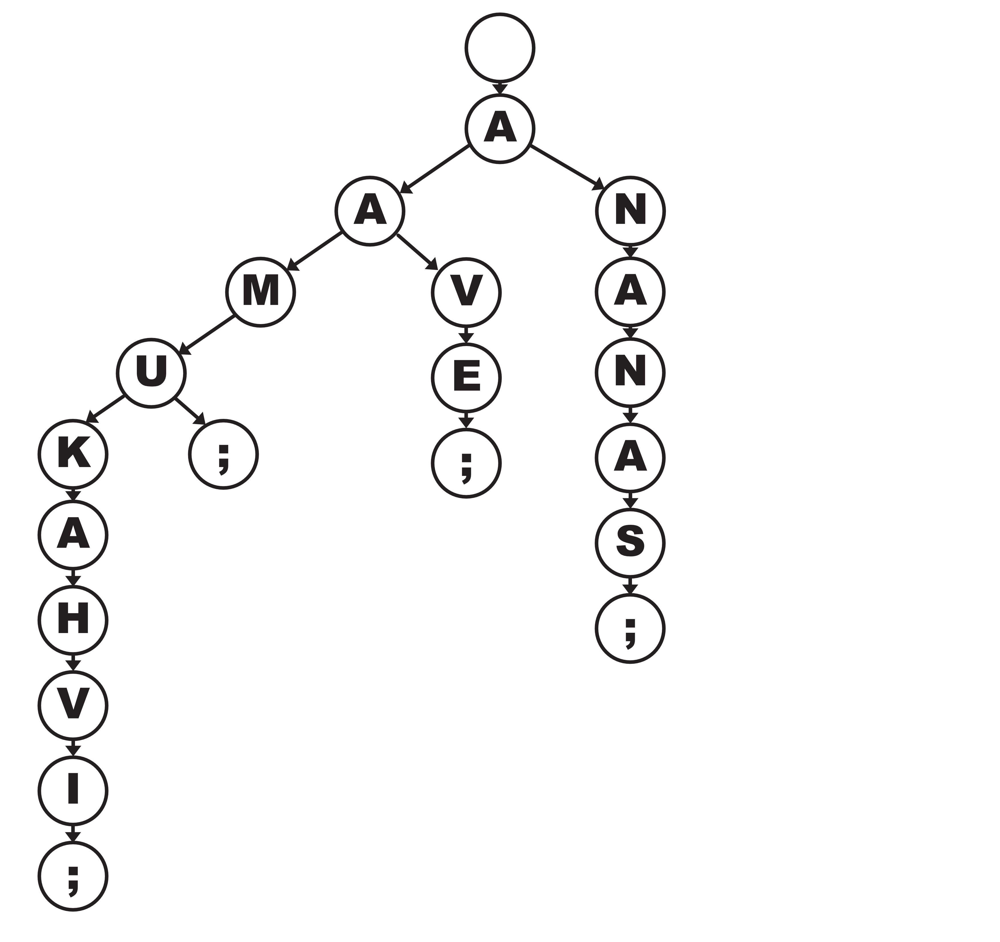

# Sanakirja

**Tämä on suhteellisen monimutkainen tehtävä.**

Tietokoneella sanakirjasta tiedon hakeminen on joskus vaikeaa. Sanakirjassa kaikki sanat ovat vain aakkosjärjestyksessä, mutta tietokone voi olla kiinnostunut sanojen muistakin ominaisuuksista. Joskus voidaan olla kiinnostuneita sanojen yhteisistä alkuosista, tai vain viidensistä kirjaimista. Tällaiseen hakemiseen tehokas tapa on rakentaa hakupuurakenne. 

Tee annetusta nykysuomen sanakirjasta hakupuurakenne siten, että jokaisen sanan kirjaimet muodostavat solmun, ja jokaisen solmun lapsisolmuiksi tulee kaikki mahdolliset seuraavat kirjaimet, joita sanassa voisi olla. Puussa pitäisi olla myös `;`-merkki (puolipiste) merkkaamassa sanojen loppumista. Esimerkiksi, jos tällainen puu tehtäisiin sanoista `aamu`, `aamukahvi`, `aave` ja `ananas`, puu näyttäisi tältä:



Tehtävässä tarvittu hakupuurakenne eroaa tavallisesta [binääripuusta](https://fi.wikipedia.org/wiki/Bin%C3%A4%C3%A4rinen_hakupuu) sillä, että yhdellä solmulla voi olla useampi lapsisolmu.

Vastauksen muotoilu olettaa valmiin puun, jonka läpi kuljetaan. Läpikulun pitäisi tapahtua syvyy ensin ja aakkosjärjestyksessä, aloittaen aina lapsisolmut `;`-solmusta ja loppuen `ö`-solmuun. Syvyys ensin tarkoittaa sitä, että ylöspäin puussa kuljetaan vain, kun alaspäin ei ole enää yhtään mahdollista kulkuvaihtoehtoa. Mitää solmua ei tietenkään merkitä tulosteeseen kahta kertaa. Jokainen lapsisolmuun päin kuljettu matka merkitään tulosteeseen `>`-merkillä, jonka jälkeen tulostetaan lapsisolmun kirjain, ja ylöspäin suuntautunut kulku `<`-merkillä ilman solmun kirjainta. Jokaisen sanan lopussa pitäisi tulostaa rivinvaihto. Esimerkiksi tuo aikaisempi `aamu`, `aamukahvi`, `aave` ja `ananas` puu näittäisi siis tältä:

```
>a>a>m>u>;
<>k>a>h>v>i>;
<<<<<<<<>v>e>;
<<<<>n>a>n>a>s>;
<<<<<<<<
```

Tällainen puurakenne toimii erittäin hyvin sellaisissa tapauksissa, jossa sanojen kirjaimia pitää käydä järjestyksessä läpi, ja tulevia kirjaimia ei voi kaikissa tapauksissa tietää etukäteen. Hyvä esimerkki tällaisen sanakirjan käytöstä olisi muunmuassa sanaristikon täyttöalgoritmi, [Boggle-lautapelin](https://fi.wikipedia.org/wiki/Boggle) automaattinen ratkaisija tai algortimi, joka yrittää tarjota mahdollisia tapoja jatkaa käyttäjän syöttämää sanaa.


## Data

Lataa alla oleva tiedosto. Siinä on riveittäin annettu erilaisia syötteitä.

Aineisto on rakennettu Suomen kielitoimiston nykysuomen sanalistan pohjalta. [https://kotus.fi/sanakirjat/kielitoimiston-sanakirja/nykysuomen-sana-aineistot/nykysuomen-sanalista/](https://kotus.fi/sanakirjat/kielitoimiston-sanakirja/nykysuomen-sana-aineistot/nykysuomen-sanalista/)

[Lataa syötetiedosto](../syotteet/sanakirja_input.txt){ .md-button }


### Vastaus

<textarea rows="10" cols="80" id="tulos"></textarea>
<button class="md-button md-button--primary" id="submit_button">Kokeile vastausta</button>
<div style="display: none;" id="vastaustiedosto">../../syotteet/sanakirja_output.txt</div>
<div style="display: none;" id="tehtavatiedosto">../../syotteet/sanakirja_input.txt</div>
<div style="text_color: red" id="virhelista"></div>