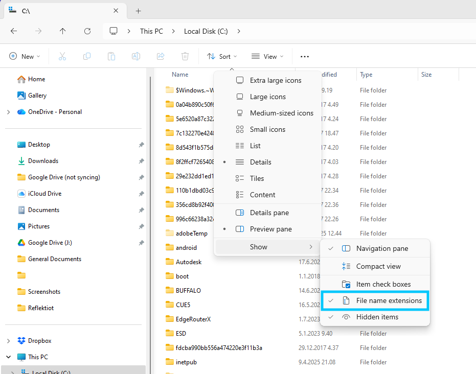
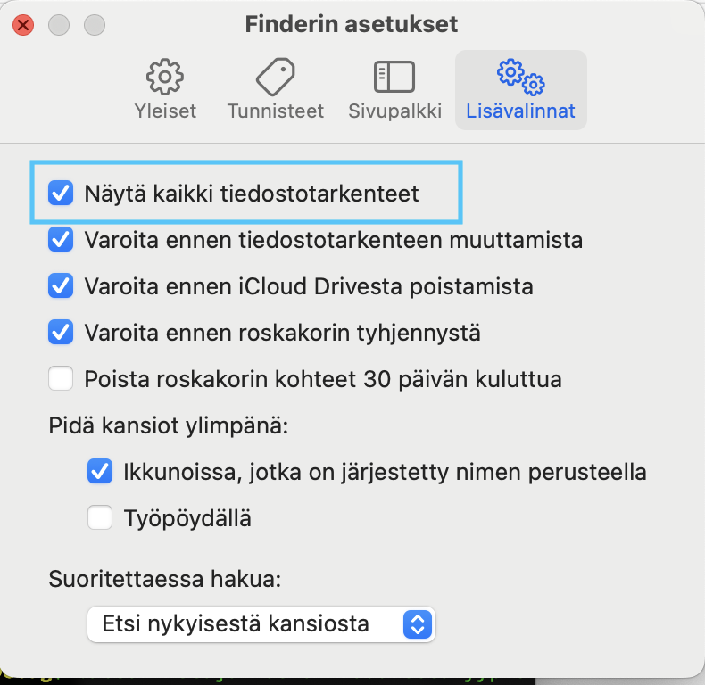

# Tiedostot ja tiedostojärjestelmät

Käytännössä kaikki, mitä tietokone työstää on pohjimmiltaan tiedosto. Jokainen suoritettava ohjelma on tiedosto, ja jokainen kuva, dokumentti ja tietokanta ovat vain erilaisia tiedostoja. Kaikki, mikä tietokoneella säilyy samanlaisena pidemmän aikaa on todennäköisesti jonkinlainen tiedosto jossain tietokoneen tiedostojärjestelmän syövereissä.


## Erilaisia tiedostoja


Tietojenkäsittelytieteen opiskelijat keskittyvät pääasiassa ohjelmien, eli suoritettavien tiedostojen tekemiseen. Tällaiset ohjelmat kuitenkin tarvitsevat myös muita tiedostoja moniin asioihin. Tiedostoja voidaan tarvita mm. 

 - Syötteenä ohjelmalle tuloksen aikaansaamiseksi.
 - Kuvatiedostoa kuvan näyttämiseksi.
 - Tiedon pitkäaikaista tallennusta varten.
 - Tiedon siirtoon koneelta tai ohjelmasta toiseen.


### Tiedostopäätteet

Tiedoston tyypin voi yleensä päätellä sen tiedostopäätteestä. Tiedostopääte on tiedoston nimen loppuun kirjoitettu, pisteellä erotettu, yleensä kolmi- tai nelikirjaiminen tekstinpätkä. Siitä voi usein päätellä minkä tyyppinen tiedosto on ja mikä ohjelma sitä voi käyttää.

Nykyään jotkin käyttöjärjestelmät piilottavat tiedostopäätteet oletuksena. Jos käyttöjärjestelmäsi tekee näin, niin kannattaa laittaa ne näkymään. Tiedostopäätteiden näkeminen auttaa sekä käyttämään tiedostoja tehokkaammin, ja estää sinua vahingossa ajamasta suoritettavia tiedostoja.

=== "Windows"
    Windows-koneilla tiedostopäätteet saa näkyville tiedostoikkunan ylävalikosta Sort > Show > File name extensions
    
=== "MacOS"
    MacOS-tietokoneille tiedostopäätteet saa näkyville Finderin asetuksista. Kun Finder-ikkuna on valittuna, paina <kbd>⌘ Command</kbd> + <kbd>,</kbd>. Uudessa ikkunassa valitse yläreunasta *Lisävalinnat*-välilehti. Välilehden ensimmäinen valinta on "Näytä kaikki tiedostotarkenteet"; jos se ei ole päällä, laita se päälle.
    { .half-width .center }

#### Yleisimpiä tiedostopäätteitä

Koska tiedostopäätteet ovat vain osa tiedoston nimeä, niitä voi olla käytännössä loputtomasti. Monet tiedostopäätteet ovat kuitenkin vakiinnuttaneet merkityksensä vain tietynlaisiin tiedostoihin. Tässä on lyhyt lista joistain yleisimmistä tiedostopäätteistä.

| Tiedostopääte | Käyttötarkoitus                                                                                         |
|---------------|---------------------------------------------------------------------------------------------------------|
| .exe          | Windows-koneiden käyttämä tunniste suoritettavilla tiedostoille, eli ohjelmille.                        |
| .txt          | Yksinkertainen tekstitiedosto. Sisältää vain tekstiä yksinkertaisella koodauksella.                     | 
| .csv          | Yksinkertainen taulukkotiedosto. Käytännössä .txt-tiedosto, jossa taulukon solut on eroteltu pilkuilla. |
| .jpg          | Yleisin kuvatiedoston muoto. Käyttää suhteellisen tehokasta pakkausalgoritmiä.                          |
| .png          | Yleinen kuvatiedoston muoto. Käyttää pakkausalgoritmiä, joka ei hukkaa tietoa.                          |
| .bmp          | Bittikartta. Suht yleinen kuvatiedoston muoto. Kuvan pikselien tieto on täysin pakkaamaton.             |
| .docx         | Microsoft Wordin käyttämä muokattava tiedostomuoto. Kaikki Wordilla luodut dokumentit ovat tällaisia.   |
| .pdf          | Tulostukseen, painamiseen ja jakamiseen tarkoitettu tiedostomuoto. Hyvin vaikea muokata.                |


Tiedosto pääte yleensä kertoo minkälaisesta tiedostosta on kyse, ja tämän vuoksi monet ohjelmat käyttävätkin sitä tunnisteena. Tiedostopääte on kuitenkin vain osa tiedoston nimeä, joten tiedostopääte voi helposti vaihtua vahingossa toiseksi. Päätteen vaihtaminen ei kuitenkaan muuta tiedoston sisältöä, joten jpg-tiedosto ei muutu pdf-tiedostoksi pelkkää päätettä vaihtamalla. 

## Kansiorakenne

Tietokoneella tiedostot on jaoteltu hierarkisen puurakenteen mukaisesti eri hakemistoihin. Jokainen hakemisto voi vuorostaan sisältää useampia tiedostoja ja hakemistoja. 

!!! shell "bash: tree"
    **C54W4KDHGK**:testikansio jonrajal$ <pop>tree</pop><br>
    .<br>
    ├── alikansio<br>
    │   ├── kuva.jpg<br>
    │   └── tiedosto.txt<br>
    ├── bar.txt<br>
    └── foo.txt<br>
    <br>
    2 directories, 4 files<br>

Komentorivillä kansiorakenteen näkee näppärästi ```tree```-komennolla. Komento näyttää aktiivisen kansion sisällön puurakenteena. Jokaisen kansion sisällä olevat tiedostot ja alikansiot näytetään haarautuvana polkuna (tai oksina) rakenteessa, ja jokainen tiedosto on puurakenteen lehti.

??? info "bash esimerkkien oletuskansio"
    Tällä verkkosivustolla kaikki esimerkkikomennot ajetaan kansiossa nimeltä ```tol-alkeet``` tai jossain sen alikansiossa. Kansion sisältö on aina seuraavanlainen ennen komennon aloitusta.
    !!! shell "bash: tree"
        **C54W4KDHGK**:tol-alkeet jonrajal$ <pop>tree</pop><br>
        .<br>
        ├── html-kansio<br>
        │   ├── alikansio<br>
        │   │   └── foobar.txt<br>
        │   └── index.html<br>
        ├── kuvia<br>
        │   ├── asd-5.jpg<br>
        │   ├── kuva-.jpg<br>
        │   ├── kuva-08.jpg<br>
        │   ├── kuva-1.jpg<br>
        │   ├── kuva-10.jpg<br>
        │   ├── kuva-2.jpg<br>
        │   ├── kuva-3.jpg<br>
        │   ├── kuva-5.jpg<br>
        │   ├── kuva-54.jpg<br>
        │   ├── kuva-6.jpg<br>
        │   ├── kuva-7.jpg<br>
        │   └── kuva-9.jpg<br>
        ├── README.txt<br>
        ├── teksti.txt<br>
        └── toinen.txt<br>
        <br>
        4 directories, 17 files

!!! hint "Juurihakemisto" 
    Tietokoneen kansiorakenne alkaa aina jostain hierarkian yläpäässä olevasta juurihakemistosta. Kaikki muut tiedostot ja hakemistot ovat tämän hakemiston, tai sen alihakemistojen, sisällä.

     Windows-käyttöjärjestelmässä jokaisella kovalevyllä on oma juurihakemisto, jolloin se yleensä kirjoitetaan vain kovalevyn nimen mukaan. Yleisin juuri Windows-koneissa on ```C:\```. 

    Unix-pohjaisissa järjestelmissä koko tietokoneella on vain yksi nimetön juurihakemisto, johon kaikki kovalevyt liitetään (eng. *mount*). Täten juurihakemisto on Linux- ja MacOS-käyttöjärjestelmissä aina ```/```. 


### Tiedostopolut

Yleensä tiedostojen sijainti tietokoneen kansiorakenteessa ilmaistaan tiedostopolkuna. Polku sisältää jokaisen kansion nimen, joiden läpi käyttäjän pitää kulkea päästäkseen tiedostoon käsiksi. Polku toimii, koska kaikki tiedostot löytyvät kansiorakenteen syövereistä ja ovat aina jonkin kansion alikansion alikansion alikansiossa. Tiedostojen sijainnin voi ilmoittaa muodossa, jossa kerrotaan juurihakemistosta alkaen jokaisen alikansion nimi, joiden läpi pitää kulkea päästäkseen kyseiseen tiedostoon. 

!!! info "Keno- ja kauttaviiva"
    Kuten varmaan jo huomasit aikaisemmista esimerkeistä, Windows-koneet ja Unix-pohjaiset koneet käyttävät eri merkkiä erottamaan alikansiot toisistaan. Windows-koneilla käytetään kenoviivaa ```\```, ja Unix-pohjaiset käyttävät kauttaviivaa ```/```. Näillä ei ole suurta merkityksellistä eroa, mutta koska ohjelmakoodissa tiedostoihin usein viitataan poluilla, niin tämä ero kannattaa huomioita.

Tiedostopolkuja voidaan kirjoittaa useammalla eri tavalla. Yleensä aikaisemman esimerkin mukainen suora, kaikki kansiot luetteleva polku ei välttämättä ole paras ratkaisu. Sen takia polkuja voi kirjoittaa myös suhteessa aktiiviseen hakemistoon ja suhteessa kotihakemistoon. 

#### Täysi, eli absoluuttinen polku

!!! abstract "Täysi polku"
    C:\\Users\\jonrajal\\Koodi\\tol-alkeet\\kuvia\\kuva-02.jpg
    /Users/jonrajal/Koodi/opetus/tol-alkeet/kuvia/kuva-02.jpg

Absoluuttinen polku on aikaisemmissa esimerkeissä mainittu alimmaisimmasta hakemistosta – juurihakemistosta – lähtevä polku. Tällaiset polut alkavat joko kovalevyn nimellä Windows-koneissa (```C:\```), tai nimettömällä juurihakemistolla Unix-koneissa (```/```).

Esimerkiksi testikoneella tol-alkeet -kansio on löytyy polusta ```/Users/jonrajal/Koodi/opetus/tol-alkeet```. Vastaavanlainen polku Windows-koneella olisi suunnilleen ```C:\Users\jonrajal\Koodi\tol-alkeet```. Molemmissa poluissa ensimmäiset kolme kansiota ovat käyttöjärjestelmässä valmiina olevia kansioita, ja viimeiset kaksi ovat käyttäjän itse luomia.

#### Suhteessa kotihakemistoon

!!! abstract "Suhteessa kotihakemistoon"
    ~/Koodi/opetus/tol-alkeet/kuvia/kuva-02.jpg

Unix-pohjaisissa käyttöjärjestelmissä polun voi kirjoittaa myös suhteessa koneelle kirjautuneen käyttäjän kotihakemistoon. Jos polku alkaa aaltoviivalla ```~```, niin kyseessä on polku suhteessa käyttäjän kotihakemistoon.

Tällaisella polulla on kaksi käyttötapausta. Yleisin hyöty on vain kirjoittamisen vähentäminen. On paljon helpompaa kirjoittaa ```~/Koodi/opetus/tol-alkeet```, kuin ```/Users/jonrajal/Koodi/opetus/tol-alkeet```. Unix-koneissa lähes kaikki käyttäjän tarvitsemat tiedostot ovat kuitenkin jossain kotihakemiston alihakemistoissa, joten polku on näppärämpi kirjoittaa lyhyemmässä muodossa.

Toinen hyöty tällaisesta kirjoitusasusta on koneilla, joille voi kirjautua useita eri käyttäjiä eri käyttäjätileillä. Jos ohjelma tai [komentosarja](../01.2-komentorivin%20jatkoa/02-bash_script.md) haluaa tallentaa, joka käyttäjälle eri tiedot tai ladata jotain käyttäjäkohtaisia tiedostoja, ohjelman ei tarvitse käyttää eri polkua jokaiselle eri käyttäjälle. ```~``` on aina aktiivisen käyttäjän kotihakemisto.

Windows-koneilla on vastaavanlainen polkuoikotie olemassa: ```%userprofile%```. Sitä ei käytetä kovinkaan usein sen pituuden vuoksi.

#### Suhteessa aktiiviseen kansioon

!!! abstract "Aktiivisen kansion polku"
    ./kuvia/kuva-02.jpg

Jokainen ohjelma suoritetaan aina jossain kansiossa. Yleensä tämä kansio on sama kuin missä ohjelman tiedosto on, mutta komentoriviltä ajaessa se voi olla myös se kansio, johon komentorivin ```cd```-komennolla on viimeisimmäksi menty.

Yleensä näppärin tapa viitata tiedostoihin on viitata niihin suhteessa tämänhetkiseen aktiiviseen kansioon tai suhteessa toisiin tiedostoihin. Tietokoneella toimiessaan ihminen yleensä haluaa käyttää niitä tiedostoja ja kansiota, jotka hän on juuri avannut. Tällainen viittaaminen mahdollistaa myös tiedostojen, kansioiden ja ohjelmien siirtelemisen tietokoneen sisällä. Kunhan vain tiedostojen väliset polut pysyvät samoina, niin kaiken pitäisi toimia.

Komentorivillä kaikki aktiiviseen kansioon suhteessa olevat polut alkavat pisteellä ja kauttaviivalla ```./```. Piste viittaa Unix-pohjaisissa järjestelmissä aina aktiiviseen kansioon, ja kauttaviiva tarkoittaa *kansiossa olevaa*. ```./``` siis tarkoittaa aktiivisessa kansiossa oleva.

Esimerkiksi, jos aktiivinen kansio on ```tol-alkeet```, ja käyttäjä haluaa kopioida tiedoston ```kuva-asd.jpg``` ```kuvia```-kansiosta kansioon ```html-kansio```, niin se onnistuu seuraavalla komennolla:

!!! shell "cp aktiivinen polku"
    **C54W4KDHGK**:tol-alkeet jonrajal$ cp ./kuvia/kuva-asd.jpg ./html-kansio/uusi-kuva.jpg

Suomeksi: kopioi tämän kansion sisällä olevasta ```kuvia```-kansiosta kuva-asd.jpg, ja luo kopiosta uusi tiedosto tässä kansiossa olevaan ```html-kansio```-nimiseen kansioon, ja laita uuden tiedoston nimeksi ```uusi-kuva.jpg```.