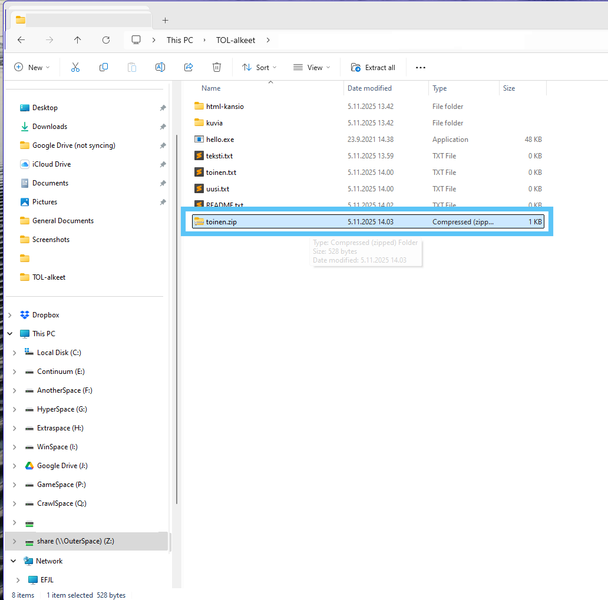
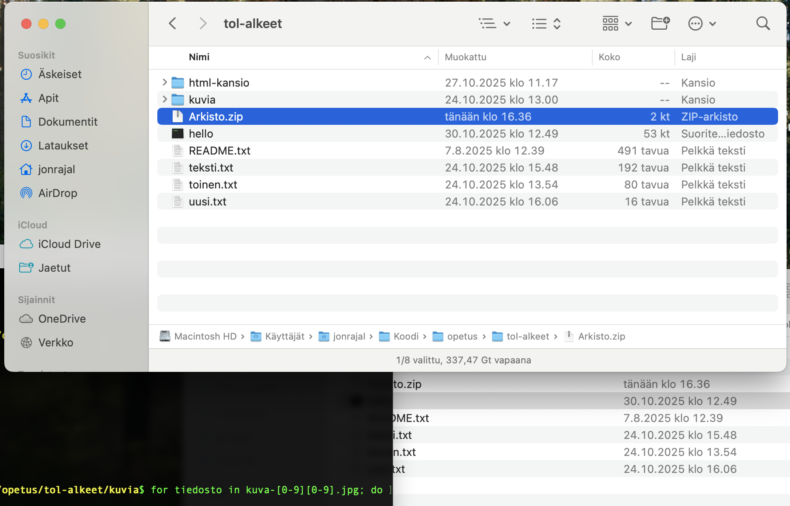
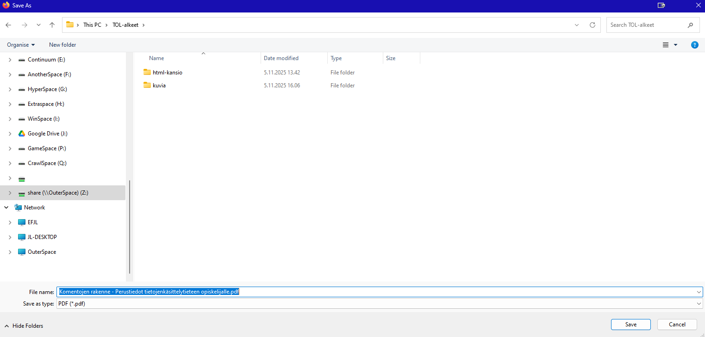
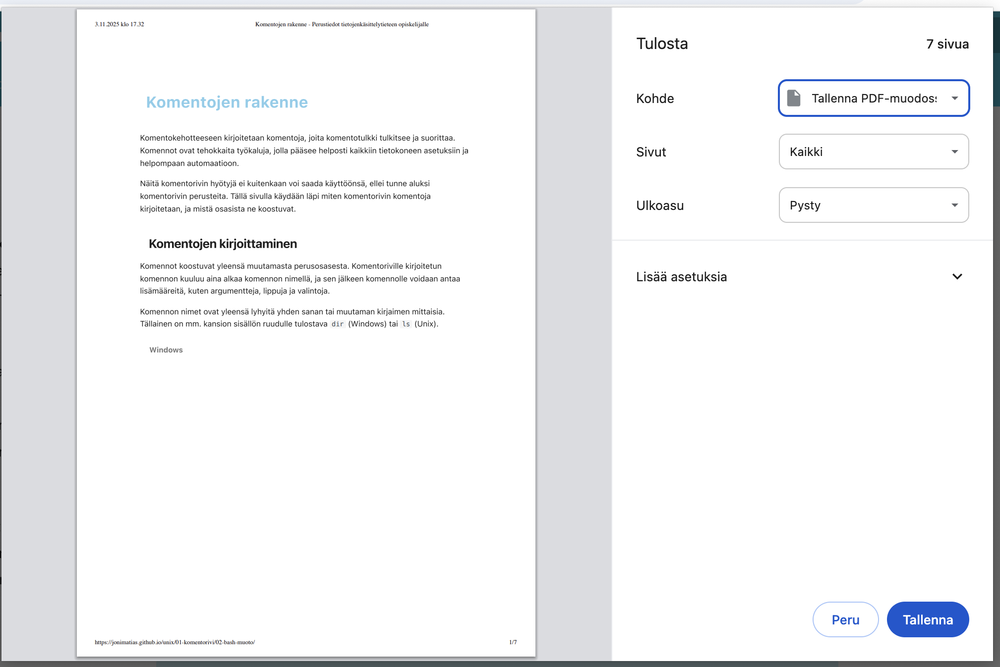

# Yleisimmät tiedostotyypit

Tämä sivu kertoo, miten muutamaa yleisintä tiedostotyyppiä voi helposti käyttää. Kaikista käydään läpi tavat niiden luomiseen ja avaamiseen.


## .zip

Zip-tiedosto on yksi pakkaustiedostojen tyyppi. Pakkaustiedostot sisältävät muita tiedostoja ja kansiota, mutta niiden sisältämä data on pakattu käyttämällä jonkinlaista pakkausalgoritmia, jolloin ne vievät vähemmän tilaa kovalevyllä. Zip-tiedostojen pakkausalgoritmi on häviötön (eng. *lossless*), eli pakatun datan purkaminen tuottaa täysin samanlaisen tuloksen kuin alkuperäinen tiedosto oli.

Tiedostokokojen vähentämisen lisäksi zip on hyvä tiedostomuoto useamman tiedoston yhtäaikaiseen lähettämiseen. Koska zip voi pakata monta tiedostoa yhdeksi tiedostoksi, näiden kaikkien tiedostojen lähettäminen vain yhtenä zippinä on monesti kannattavaa. Vastaanottajan täytyy vain osata purkaa zip-tiedosto päästäkseen tiedostoihin käsiksi.

### zip-tiedoston luominen

=== ":os-win: Windows"
    Windowsilla zip-tiedoston luonti tapahtuu helpoiten resurssienhallinnassa. Valitse kaikki tiedostot ja/tai kansiot, jotka haluat lisätä pakettiin. Sen jälkeen paina jotain valittua tiedostoa/kansiota hiiren "väärällä" napilla, ja valitse valikosta ```Lähetä kohteeseen``` (eng. ```Send To```) ja valitse sitten ```Pakattu (zip-kansio)```.

    

    Kun pakkaus on suoritettu, kansioon pitäisi ilmestyä uusi tiedosto, jonka nimenä on jonkin paketissa olevan tiedoston tai kansion nimi, ja päätteenä ".zip". 

    

=== ":os-mac: MacOS"
    Macillä zip-tiedosto saadaan tehtyä helposti Finderilla. Valitse vain kaikki tiedostot, jotka haluat paketoida. Sen jälkeen paina jotain valittua tiedostoa hiiren oikeaa näppäintä (tai paina <kbd>^ Control</kbd> pohjassa hiiren vasenta näppäin), ja valitse valikosta ```Pakkaa```.

    

    Kun pakkaus on suoritettu, kansioon pitäisi ilmestyä uusi tiedosto nimeltä ```Arkisto.zip``` (eng. ```Archive.zip```).

    

=== ":os-linux: Ubuntu"


### zip-tiedoston purkaminen

=== ":os-win: Windows"
    Windowsilla zipin purkaminen pitää tehdä valitsemalla ```Pura kaikki...``` hiiren "väärän" napin valikosta, kyseisen zip-tiedoston ollessa valittuna. 
    

    Avautuvasta dialogista valitse haluamasi kansio tiedostojärjestelmässäsi, minne haluat uuden alikansion luotavan paketin nimellä, minkä alle puolestaan kaikki paketissa olevat tiedostot puretaan. Jos valitset myös valinnan, missä sanotaan, että näytä puretut tiedostot kun operaatio on valmis, avautuu lopuksi uusi resurssienhallintaikkuna, missä puretut tiedostot ovat.

    

    

    Kannattaa huomata, että vaikka resurssienhallinta pystyy näyttämään purkamattomankin zipin sisällä olevat tiedostot, monesti ne pitää purkaa paketista ennen kuin niitä voi käyttää vaikkapa jostakin ohjelmasta.


=== ":os-mac: MacOS"
    Macilla zipin purkaminen on yksinkertaista. Se purkautuu automaattisesti uuteen kansioon kaksoisklikkaamalla zip-tiedostoa. Uuden kansion nimi on oletuksena zip-tiedoston nimi.

    Kansion sisältö alikansioineen on identtinen alunperin pakatun kansiorakenteen kanssa.

=== ":os-linux: Ubuntu"


## .pdf

PDF-tiedostot on monipuolinen dokumenttitiedostomuoto, joka on alunperin luotu painotalojen tarpeisiin. Siitä tulee myös tiedostomuodon nimi: printable document format (suom. *painettava tiedostomuoto*). Nykypäivänä PDF vastaa entisaikojen nidottua paperinivaskaa.

PDF-tiedostoja käytetään nykyään tekstidokumenttien jakamiseen, muutamasta syystä:

 - Kaikki käyttöjärjestelmät tukevat sitä.
 - Niiden avaamiseen ei yleensä tarvitse asentaa erillistä ohjelmaa; vähintään jokainen verkkoselain osaa näyttää niiden sisällön.
 - Niiden muokkaaminen on vaikeaa, jolloin sisältö pysyy helposti samana.


### PDF-tiedoston luominen

Helpoin tapa luoda PDF-tiedosto on käyttää ns. pdf-tulostinta. Pdf-tulostin on tulostinajuri, joka tuottaa tulostettavasta aineistosta pdf-tiedoston lähettämättä sitä ulkoiselle tulostimelle. Pdf-tulostimen käyttö on siitä näppärää, että sitä voi käyttää käytännössä missä tahansa ohjelmassa, joka tukee tulostusta. Esimerkiksi nettisivuja voi muuttaa helposti pdf-tiedostoiksi.

=== ":os-win: Windows"
    Kun sinulla on haluamasi sisältö auki missä tahansa ohjelmassa, voit avata tulostustoiminnon joko valikoista, tai (yleensä) painamalla <nowrap><kbd>Ctrl</kbd>+<kbd>P</kbd></nowrap> yhtäaikaa. Tällöin avautuu tulostusikkuna, jonka ulkoasu voi hieman vaihdella ohjelmien välillä. 

    

    Riippumatta siitä, minkänäköinen tulostusikkuna on, niissä valitaan yleensä alasvetovalikosta (nimeltään esim. *Tulostin* (eng. *Destination*)) mille tulostimelle halutaan tulostuksen menevän. Valitse tulostimeksi **Tallenna PDF-muodossa** (eng. **Save to PDF**).

    

    Tämän jälkeen oikean alareunan *Tulosta* (eng. *Print*)-nappi vaihtuu *Tallenna* (eng. *Save*)-napiksi. Paina tuota kyseistä nappia.

    

    Tallenna-napin painaminen avaa käyttöjärjestelmän tiedostojen tallennusikkunan. Tästä voit valita minne haluat tallentaa tiedoston. 

    

    Jos järjestelmässäsi ei ole valintaa *Tallenna PDF-muodossa* niin voit kokeilla vaihtoehtoa *Microsoft Print to PDF*, joka toimii periaatteessa samalla tavalla.

=== ":os-mac: MacOS"
    Kun sinulla on haluamasi sisältö auki missä tahansa ohjelmassa, niin voit painaa <nowrap><kbd>⌘ Command</kbd>+<kbd>P</kbd></nowrap> yhtä aikaa. Tämä avaa jonkinlaisen tulostusikkunan. Tulostusikkunan ulkoasu voi vaihdella ohjelmasta toiseen, mutta tässä esimerkissä käytetään Chromen tulostusvalikkoa.

    

    Oli tulostusvalikko minkä tahansa näköinen, kaikissa niissä voi valita tulostimen. Chromella tulostin valitaan alasvetovalikosta nimeltä *Kohde*. Valitse tulostimeksi **Tallenna PDF-muodossa**.

    

    Tämän jälkeen oikean alareunan *Tulosta*-nappi vaihtuu *Tallenna*-napiksi. Paina tätä uutta nappia.

    

    Tallenna-napin painaminen avaa käyttöjärjestelmän tiedostojen tallennusikkunan. Tästä voit valita minne haluat tallentaa tiedoston. Helpoimmalla pääset, jos painat vain *Tallenna*-painiketta. Tiedosto oletuksella tallentuu todennäköisesti työpöydälle.

    -----
    #### Oletustulostusnäkymä

    Monessa ohjelmassa ei ole omaa tulostusnäkymää, vaan ne käyttävät käyttöjärjestelmän oletustulostusnäkymää. Tässä näkymässä on erillinen PDF-painike PDF-tulostusta varten.

    

=== ":os-linux: Ubuntu"


Näiden kikkojen lisäksi kaikki tekstinkäsittelyohjelmat myös mahdollistavat tiedoston viemisen (eng. *export*) pdf-muodossa. Tämä valinta yleensä löytyy jostain tiedoston tallennusnapin vierestä.

### PDF-tiedoston avaaminen

Kaikki käyttöjärjestelmät tukevat PDF-tiedostojen avaamista suoraan. Sisällön saa näkyviin kaksoisklikkaamalla PDF-tiedostoa.
