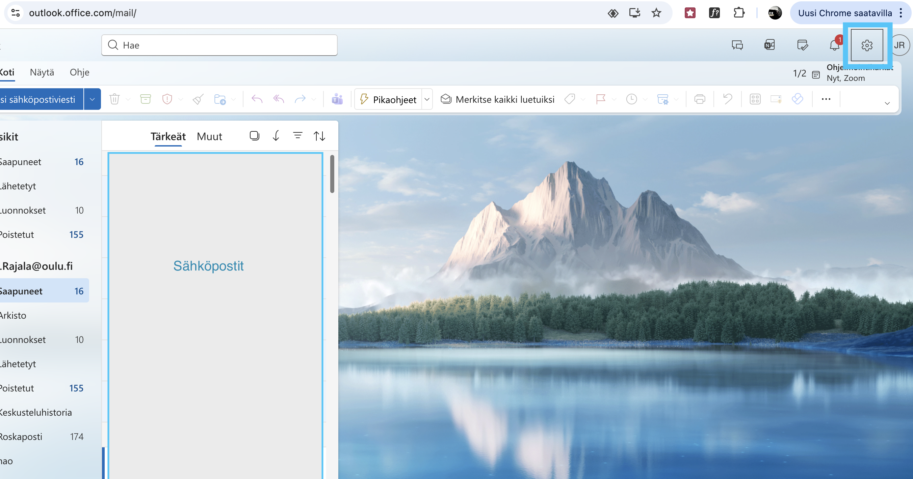

# Opiskelijan sähköposti

Oulun yliopisto tarjoaa kaikille opiskelijoille sähköpostiosoitteen. Tämä sähköpostiosoite on muotoa <käyttäjätunnus>@student.oulu.fi. Tätä samaa sähköpostiosoitetta käytetään myös kirjautumaan moniin muihin yliopiston palveluihin, kuten Moodleen, Peppiin ja yliopiston tietokoneille.

Samoin, kun yliopisto haluaa kertoa opiskelijalle jotain hänen kurssisuorituksesta, pakollisista toimista tai muista ilmoitusluontoisista asioista, yliopisto tekee tämän yliopiston tarjoaman sähköpostiosoitteen kautta.

Tarkemmat tiedot opiskelijasähköpostin käytöstä löytyy tietohallinnon sivuilta.

[Tietohallinon ohjeet opiskelijasähköpostin käytöstä](https://ict.oulu.fi/1833/){ .md-button }

## Sähköpostiautomaatio

Sähköposti on myös automatisoitavissa monilla tavoin. Yleisimmät sähköpostiautomaation käyttötapaukset liittyvät vastaanotettujen sähköpostien luokitteluun. Palveluntarjoaja -- kuten Microsoftin Office -- on automatisoinut tällaista kategorisointia jo valmiiksi käyttäjälle, mutta jokainen voi luoda lisää automaatioita omaan sähköpostilaatikkoonsa.

Office365 paketissa sähköpostiautomaatiota kutsutään säännöiksi. Uusia sääntöjä voi luoda seuraavia ohjeita seuraamalla:

 - **1.** Kirjaudu omaan sähköpostiisi osoitteessa [office365.oulu.fi](https://office365.oulu.fi).

 - **2.** Avaa tilisi asetukset painamalla oikean yläkulman hammasratasikonia.

 - **3.** Valitse vasemman reunan valikosta kohta *Säännöt*.
 - **4.** Tässä näkymässä voi luoda uusia sääntöjä painamalla *Luo uusi sääntö* painiketta.

Jokainen sääntö tarvitsee vain kolme asiaa: nimen, ehdon ja toiminnan.

 - **Nimi** on täysin vapaavalintainen kuvaus, jolla voit tunnistaa luomasi säännön. Hyödyllinen, jos sinulla on paljon sääntöjä.
 - **Ehto** kertoo milloin sääntö tulee voimaan. Alasvetovalikossa on paljon valittavia ehtoja joita o365 tukee. Osa ehdoista voi tarvia lisätietoja.
 - **Toiminto** valitsee mitä tapahtuu aina, kun ehto tapahtuu. Alasvetovalikosta löytyy monia tuettuja toimintoja.

### Sähköpostin uudelleenohjaus

Yksi yleinen sähköpostiautomaatio on sähköpostin uudelleen ohjaus, eli osan tai kaikkien vastaanotettujen sähköpostien lähettäminen toiseen osoitteeseen. Se on käytännöllinen, jos itsellä on käytössä useampia sähköpostiosoitteita, joita kaikkia ei jaksa seurata. Tällöin harvemmin käytössä olevasta osoitteesta voi ohjata kaiken postin yleisemmin käytössä olleeseen osoitteeseen, josta näitä voi lukea.

Yliopisto-opiskelijana tämä voi olla käytännöllinen ominaisuus, jos sinulla on jo käytössä oma henkilökohtainen sähköposti. Jos ohjaat kaiken yliopiston opiskelijasähköpostiin tulleen viestit itsellesi, niin sinun ei tarvitse seurata yliopiston postilaatikkoa erikseen.

Yliopiston sähköpostissa uudelleenohjauksen voi luoda säännöillä.

Yllä olevassa kuvassa on esimerkki uudelleenohjauksesta. Siinä ehdoksi on valittu *Käytä kaikkiin viesteihin*, jolloin uudelleen ohjaus tapahtuu jokaiselle vastaanotetulle viestille.

Toiminnoksi on valittu *Lähetä edelleen osoitteeseen*, ja uudeksi osoitteeksi on laitettu opiskelijan henkilökohtainen gmail-osoite. Tämä tarkoittaa sitä, että kaikki opiskelijasähköpostiin saapuvat viestit, jotka täyttävät ehdon (tässä tapauksessa siis kaikki) lähetetään sellaisenaan annettuun gmail-osoitteeseen. Alkuperäisen viestit jäävät myös opiskelijasähköpostiin, mutta gmail-osoitteeseen tulee kaikista kopio.
