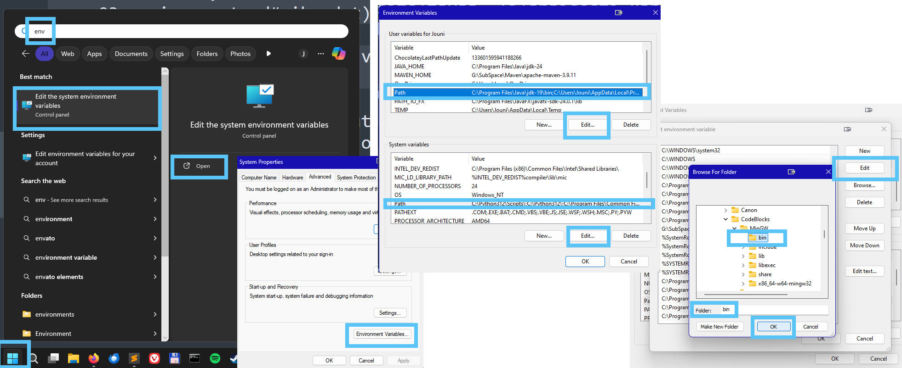

# Ohjelmien asentaminen

Internet on pullollaan erilaisia komentorivillä suoritettavia ohjelmia. Osan niistä voi ladata ja asentaa kuin tavallisen graafisen käyttöliittymän ohjelman, mutta monet eivät tue graafisen puolen asennusohjelmia. Silloin käyttäjälle jää vain muutama vaihtoehto:

 - Ladata ohjelma itse, ja laittaa se kansioon, joka on määritelty [ympäristömuuttujissa](../01.2-komentorivin-jatkoa/03-environment.md). Tämä kuitenkin voi tuottaa ongelmia, jos asennettava ohjelma tarvitsee toimiakseen muita ohjelmia, joita sinulla ei ole asennettuna.
 - Käyttää paketinhallintaohjelmaa, joka lataa ja asentaa tarvittavan ohjelman koneellesi ja kaikki sen riippuvuudet.


## Paketinhallintaohjelmat

Paketinhallintaohjelmat ovat erillisiä asennettavia komentoriviohjelmia, jotka on tarkoitettu muiden ohjelmien asentamisen helpottamiseksi. Nämä ovat usein käyttöjärjestelmä-, ohjelmointikieli- ja shell-kohtaisia. Osa paketinhallintaohjelmista, kuten Ubuntun ```apt``` on valmiiksi asennettu käyttöjärjestelmän mukana. Osa pitää kuitenkin asentaa itse. Tällaisia ohjelmia on mm.:

 - [WinGet Windowsille](https://learn.microsoft.com/en-us/windows/package-manager/winget/)
 - [Homebrew MacOS:lle](https://brew.sh/)
 - [apt Ubuntulle](https://wiki.debian.org/AptCLI)
 - [npm nodelle](https://www.npmjs.com/)
 - [pip pythonille](https://pypi.org/project/pip/)


### Paketinhallintaohjelman asennus

=== ":os-win: Windows - WinGet"
    Microsoft on pyrkinyt viime aikoina lisäämään käyttäjiensä riippuvuutta omista palveluistaan, joista yksi on Microsoft Store. Vaikka Windowsille pystyy asentamaan ohjelmia sitä kautta, on suoraan asennustiedostojen lataaminen netistä ja niistä suoraan asentaminen yleistä toimintatapaa Windows-maailmassa - ja siitä on sekä hyviä että hyvin huonoja seurauksia. Hyviä puolia - jos niin haluaa ajatella - on vähenevä riippuvuus Microsfotin palveluista ja sitä kautta omien tietojensa pysyminen vähemmän kauppatavarana. Huonona puolena on kohonnut riski saada haittaohjelmia omalle koneelleen, varsinkin jos ei tiedä mitä on tekemässä. 

    Jos haluaa, niin Windowsille voi asentaa WinGet-ohjelman, joka tulee asentaa Microsoft Storesta, hakemalla "Sovellusten Asennusohjelma"-nimistä pakettia (eng. App Installer). Monissa yhteyksissä tämä on tullut jo valmiina koneelle, tai tullut huomaamatta asennettua muitten työkalujen yhteydessä. 

    


=== ":os-mac: MacOS - brew"
    Applella ei ole omaa järjestelmään sisäänrakennettua paketinhallintaohjelmaa, mutta Homebrewistä on tullut vahva yleisesti käytössä oleva standardi. Homebrewin voi asentaa ajamalla seuraavan komennon komentorivillä:
    !!! shell "Asenna brew"
        **C54W4KDHGK**:~ jonrajal$ <pop>/bin/bash -c "$(curl -fsSL https://raw.githubusercontent.com/Homebrew/install/HEAD/install.sh)"</pop>

=== ":os-linux: Ubuntu - apt"
    ```apt``` on heti käyttövalmis Ubuntulla. Se on asennettuna koneelle oletuksena.


### Pakettien asentaminen

=== ":os-win: Windows - WinGet"
    Winget toimii pitkälti samalla periaatteella kuin muidenkin järjestelmien pakettienhallintaohjelmistot: komentoriviltä voi winget -komennoilla etsiä, listata asentaa ja poistaa asennettuja ohjelmia. Aloitetaan vaikkapa listaamalla mitä ohjelmia koneella jo on asennettuna komennolla ```winget list```. Riippuen siitä, miten pitkään konetta on tullut käytettyä, listaus voi olla pitkäkin. 
    !!! shell "cmd.exe: winget list"
        C:\TOL-alkeet><pop>winget list</pop>
        Name                          Id                         Version        Available  Source
        &ndash;&ndash;&ndash;&ndash;&ndash;&ndash;&ndash;&ndash;&ndash;&ndash;&ndash;&ndash;&ndash;&ndash;&ndash;&ndash;&ndash;&ndash;&ndash;&ndash;&ndash;&ndash;&ndash;&ndash;&ndash;&ndash;&ndash;&ndash;&ndash;&ndash;&ndash;&ndash;&ndash;&ndash;&ndash;&ndash;&ndash;&ndash;&ndash;&ndash;&ndash;&ndash;&ndash;&ndash;&ndash;&ndash;&ndash;&ndash;&ndash;&ndash;&ndash;&ndash;&ndash;&ndash;&ndash;&ndash;&ndash;&ndash;&ndash;&ndash;&ndash;&ndash;&ndash;&ndash;&ndash;&ndash;&ndash;&ndash;&ndash;&ndash;&ndash;&ndash;&ndash;&ndash;&ndash;&ndash;&ndash;&ndash;&ndash;&ndash;&ndash;&ndash;&ndash;&ndash;&ndash;&ndash;&ndash;&ndash;&ndash;&ndash;&ndash;
        draw.io 20.7.4                JGraph.Draw                20.7.4           29.0.3    winget
        draw.io 15.4.0                JGraph.Draw                15.4.0                     winget
        Windows Driver Package - Cors ARP\Machine\X64\A2206C099… 07/14/2017       3.3
        AMD Software                  ARP\Machine\X64\AMD Catal… 19.30.28
        Android Studio                ARP\Machine\X64\Android S… 2024.3
        AutoHotkey 1.1.30.00          AutoHotkey.AutoHotkey      1.1.30.00        2.0.19    winget
        Autodesk Netfabb Standard 20  ARP\Machine\X64\Autodesk … 9.3.1793
        DisplayFusion                 BinaryFortress.DisplayFus… 11.1.1.0                   winget
        DisplayFusion                 BinaryFortress.DisplayFus… Unknown                    winget
        Logitech Capture              ARP\Machine\X64\Capture    2.06.8
        Git                           Git.Git                    2.33.1           2.51.2    winget
        HxD Hex Editor 2.5            MHNexus.HxD                2.5                        winget
        ...
        WinAppRuntime.Main.1.2-p1     MSIX\MicrosoftCorporation… 2000.609.1413.0
        WinAppRuntime.Main.1.5        MSIX\MicrosoftCorporation… 5001.373.1736.0
        WinAppRuntime.Singleton-p1    MSIX\MicrosoftCorporation… 2000.609.1413.0
        WinAppRuntime.Singleton       MSIX\MicrosoftCorporation… 8000.642.119.0
        Windows-alijärjestelmä Linuxi MSIX\MicrosoftCorporation… 2.6.1.0
        Windows Web Experience Pack   MSIX\MicrosoftWindows.Cli… 525.31002.140.0
        Laitteiden välisten kokemust… MSIX\MicrosoftWindows.Cro… 0.25101.31.0
        NVIDIA Control Panel          MSIX\NVIDIACorp.NVIDIACon… 8.1.969.0
        Local AI Manager for Microso… MSIX\aimgr_0.20.29.0_x64_… 0.20.29.0
        Sähköposti ja kalenteri       MSIX\microsoft.windowscom… 16005.14326.223…

    Jos haluat tietää onko jo jokin tietty ohjelma asennettu, voi komennolle antaa vielä erikseen parametriksi etsittävän ohjelman nimen.
    !!! shell "cmd.exe: winget list ohjelmannimi"
        C:\TOL-alkeet><pop>winget list CodeBlocks</pop>
        Name       Id                          Version Source
        &ndash;&ndash;&ndash;&ndash;&ndash;&ndash;&ndash;&ndash;&ndash;&ndash;&ndash;&ndash;&ndash;&ndash;&ndash;&ndash;&ndash;&ndash;&ndash;&ndash;&ndash;&ndash;&ndash;&ndash;&ndash;&ndash;&ndash;&ndash;&ndash;&ndash;&ndash;&ndash;&ndash;&ndash;&ndash;&ndash;&ndash;&ndash;&ndash;&ndash;&ndash;&ndash;&ndash;&ndash;&ndash;&ndash;&ndash;&ndash;&ndash;&ndash;&ndash;&ndash;&ndash;&ndash;&ndash;
        CodeBlocks CodeBlocks.CodeBlocks.MinGW 25.03   winget

    Jos haluat asentaa jonkin uuden ohjelman, voit ensin etsiä asennettavien ohjelmien valikoimasta komennolla ```winget search``` ja kirjoittamalla perään etsittävän ohjelman nimen tai sen osan. Esimerkiksi ```winget search CodeBlocks``` löytää kaksi vaihtoehtoa
    !!! shell "cmd.exe: winget search CodeBlocks"
        C:\TOL-alkeet><pop>winget search CodeBlocks</pop>
        Name                    Id                          Version Match                   Source
        &ndash;&ndash;&ndash;&ndash;&ndash;&ndash;&ndash;&ndash;&ndash;&ndash;&ndash;&ndash;&ndash;&ndash;&ndash;&ndash;&ndash;&ndash;&ndash;&ndash;&ndash;&ndash;&ndash;&ndash;&ndash;&ndash;&ndash;&ndash;&ndash;&ndash;&ndash;&ndash;&ndash;&ndash;&ndash;&ndash;&ndash;&ndash;&ndash;&ndash;&ndash;&ndash;&ndash;&ndash;&ndash;&ndash;&ndash;&ndash;&ndash;&ndash;&ndash;&ndash;&ndash;&ndash;&ndash;&ndash;&ndash;&ndash;&ndash;&ndash;&ndash;&ndash;&ndash;&ndash;&ndash;&ndash;&ndash;&ndash;&ndash;&ndash;&ndash;&ndash;&ndash;&ndash;&ndash;&ndash;&ndash;&ndash;&ndash;&ndash;&ndash;&ndash;&ndash;&ndash;&ndash;&ndash;&ndash;&ndash;&ndash;&ndash;&ndash;
        Code::Blocks            CodeBlocks.CodeBlocks       25.03   ProductCode: codeblocks winget
        Code::Blocks with MinGW CodeBlocks.CodeBlocks.MinGW 25.03   ProductCode: codeblocks winget

    joista yleensä haluttaan asentaa versio, jossa tulee C-kääntäjä mukana, eli MinGW-versio. Tällöin tulee kiinnittää huomiota Id-sarakkeeseen, jossa oleva tunnus pitää antaa asennuskomennolle sitten argumenttina: ```winget install CodeBlocks.CodeBlocks.MinGW``` Tämä lataa asennuspaketin (odottele sinisen palkin edistymistä) ja käynnistää asennuksen. Muutamia asennustoimenpiteitä voi joutua tekemään asennuksen päätyttyä ensimmäisellä käynnistyskerralla, mutta muuten ohjelman pitäisi asentua "normaalisti".
    !!! shell "cmd.exe: winget install CodeBlocks.CodeBlocks.MinGW"
        C:\TOL-alkeet><pop>winget install CodeBlocks.CodeBlocks.MinGW</pop>
        Found Code::Blocks with MinGW [CodeBlocks.CodeBlocks.MinGW] Version 25.03
        This application is licensed to you by its owner.
        Microsoft is not responsible for, nor does it grant any licenses to, third-party packages.
        Downloading https://sourceforge.net/projects/codeblocks/files/Binaries/25.03/Windows/codeblocks-25.03mingw-setup.exe/download
          ██████████████████████████████   403 MB /  403 MB
        Successfully verified installer hash
        Starting package install...
        Successfully installed

    Toinen asia, johon voi haluta kiinnittää huomiota, on tuo Source-tieto, eli mistä lähteestä ohjelma on asentumassa. Vaihtoehtona voi olla esimerkiksi ```msstore``` eli Microsoft Store, tai ```winget``` eli ohjelman omat tiedot ohjelman lähteestä. 

    Joka tapauksessa on hyvä katsoa tarkempia tietoja asennettavasta paketista, ihan vaan jotta tietää mistä ja mitä on asentelemassa. Tarkemmat tiedot paketista saa komennolla ```winget show``` ja perään jonkin paketin ```Id```-tieto, esim:
    !!! shell "cmd.exe: winget search Opera"
        C:\TOL-alkeet><pop>winget search Opera</pop>
        Name                   Id                   Version         Match                  Source
        &ndash;&ndash;&ndash;&ndash;&ndash;&ndash;&ndash;&ndash;&ndash;&ndash;&ndash;&ndash;&ndash;&ndash;&ndash;&ndash;&ndash;&ndash;&ndash;&ndash;&ndash;&ndash;&ndash;&ndash;&ndash;&ndash;&ndash;&ndash;&ndash;&ndash;&ndash;&ndash;&ndash;&ndash;&ndash;&ndash;&ndash;&ndash;&ndash;&ndash;&ndash;&ndash;&ndash;&ndash;&ndash;&ndash;&ndash;&ndash;&ndash;&ndash;&ndash;&ndash;&ndash;&ndash;&ndash;&ndash;&ndash;&ndash;&ndash;&ndash;&ndash;&ndash;&ndash;&ndash;&ndash;&ndash;&ndash;&ndash;&ndash;&ndash;&ndash;&ndash;&ndash;&ndash;&ndash;&ndash;&ndash;&ndash;&ndash;&ndash;&ndash;&ndash;&ndash;&ndash;&ndash;&ndash;&ndash;&ndash;&ndash;&ndash;&ndash;
        Opera Browser          XP8CF6S8G2D5T6       Unknown                                msstore
        Opera GX               XPDBZ4MPRKNN30       Unknown                                msstore
        Opera Stable           Opera.Opera          124.0.5705.15   Moniker: opera         winget
        Opera beta             Opera.Opera.Beta     124.0.5705.12   Command: opera         winget
        Epilogue Operator      Epilogue.EpilogueOp… 1.8.0                                  winget
        Opera developer        Opera.Opera.Dev      125.0.5707.0                           winget
        Opera GX Stable        Opera.OperaAir       122.0.5643.188                         winget
        Opera Crypto Stable    Opera.OperaCrypto    108.0.5067.28                          winget
        Opera GX Stable        Opera.OperaGX        123.0.5669.76                          winget
        Secrets OPerationS     SecretsOPerationS.S… 3.11.0                                 winget
        Ollama Operator        nekomeowww.OllamaOp… 0.10.10                                winget
        Secrets OPerationS     Mozilla.SOPS         3.7.3                                  winget
        Blocknet               Blocknetproject.Blo… 4.4.1           Tag: interoperability  winget
        Media Creation Tool    Microsoft.MediaCrea… 10.0.26100.6584 Tag: operatingsystemu… winget
        NumeRe - Framework fo… NumeRe.NumeRe        1.1.7.2508      Tag: matrix operation  winget
        Browser Tamer          aloneguid.bt         5.3.0           Tag: opera-browser     winget
        win-vind               pit-ray.win-vind     5.13.2          Tag: gui-operation     winget

    ja

    !!! shell "cmd.exe: winget show Opera.Opera"
        C:\TOL-alkeet><pop>winget show Opera.Opera</pop>
        Found Opera Stable [Opera.Opera]
        Version: 124.0.5705.15
        Publisher: Opera Software
        Publisher Url: https://www.opera.com/
        Publisher Support Url: https://www.opera.com/help
        Author: Opera Norway AS
        Moniker: opera
        Description: Opera is a multi-platform web browser developed by Opera Software. Opera is a Chromium-based browser. It distinguishes itself from other browsers through its user interface, functionality, and other features.
        Homepage: https://www.opera.com/browsers/opera
        License: Freeware
        License Url: https://legal.opera.com/eula/computers/
        Privacy Url: https://legal.opera.com/privacy/
        Copyright: Copyright © 1995-2025 Opera Software AS. All rights reserved.
        Copyright Url: https://legal.opera.com/terms/
        Documentation:
          Tutorial: https://www.opera.com/tutorials
          FAQ: https://help.opera.com/faq/
        Tags:
          browser
          chromium
          internet
          web
          webpage
          manifestv2
          mv2
        Installer:
          Installer Type: exe
          Installer Url: https://get.geo.opera.com/pub/opera/desktop/124.0.5705.15/win/Opera_124.0.5705.15_Setup_x64.exe
          Installer SHA256: 527739259f2a53a1900e8e13a53502dba36c958bdaacf110d23495d0517ea753
          Offline Distribution Supported: true


=== ":os-mac: MacOS - brew"    
    Kun Homebrew on asennettu, uusien komentoriviohjelmien asentaminen on suhteellisen helppoa: asentaminen tapahtuu komennolla ```brew install <ohjelman nimi>```. Homebrewilla asennettavien ohjelmien lista löytyy osoitteesta: [https://formulae.brew.sh/formula/](https://formulae.brew.sh/formula/).

    Esimerkiksi jos haluaa asentaa koneelleen ohjelman ```ffmpeg```, joka on tehokas (ja vaikeakäyttöinen) videotiedostojen muokkausohjelma, se tapahtuu komennolla:

    !!! shell "brew install"
        **C54W4KDHGK**:~ jonrajal$ <pop>brew install ffmpeg</pop>
    
    Brewin kautta voi myös asentaa graafisen käyttöliittymän sovelluksia. Brew kutsuu näitä nimellä cask. Jos haluat asentaa Firefoxin koneellesi brewin avulla, komento on muotoa:

    !!! shell "brew install --cask"
        **C54W4KDHGK**:~ jonrajal$ <pop>brew install --cask firefox</pop>

    Kaikki caskit löytyvät osoitteesta [https://formulae.brew.sh/cask/](https://formulae.brew.sh/cask/). Kirjasintyypeille, eli fonteille, on oma cask-lista: [https://formulae.brew.sh/cask-font/](https://formulae.brew.sh/cask-font/).

    Jokainen paketti asentuu eri tavalla, joten kannattaa tutustua jokaisen ohjelman dokumentaatioon sen käytöstä. 

=== ":os-linux: Ubuntu - apt"
    ```apt``` on heti käyttövalmis Ubuntulla. Se on asennettuna koneelle oletuksena.
    **TODO:** Kirjoita kuvaus ja esimerkit


## Omien ohjelmien korottaminen komennoiksi

Tavallisesti ohjelman ajaminen tapahtuu tietämällä ohjelman sijainti. Ohjelma käynnistetään aina tietämällä minkä tahansa polun suoritettavaan tiedostoon, ja kutsumalla ohjelmaa polun kautta. Joskus käyttäjä voi kuitenkin haluta ajaa omia ohjelmiaan samalla tavalla kuin komentoja, eli missä tahansa kansiossa ja välittämättä ohjelman sijainnista.

Jos olet tehnyt itse ohjelman, jota haluaisit käyttää kuten komentoja, niin kannattaa tutustua ympäristömuuttujiin ja ohjelmien oikeuksiin [niistä kertovalla sivulla](../01.2-komentorivin-jatkoa/03-environment.md).

Pääasiallisesti prosessi kuitenkin toimii seuraavalla tavalla:
=== ":os-win: PATH-ympäristömuuttuja"
    Tarkista, onko ohjelma jo jonkin sellaisen hakemistopolun päässä, joka löytyy ```PATH```-ympäristömuuttujasta. Voit tarkistaa ```PATH```-ympäristömuuttujan sisällön joko komentoriviltä ```set PATH```-komennolla, tai graafiselta puolelta järjestelmän asetuksista. Helpoiten asetukset löytyvät hakemalla sanaa ```ymp``` tai englanniksi ```env```, ja valitsemalla ```Muokkaa ympäristömuuttujia``` (engl. ```Environment variables```). Avautuvasta ikkunasta voi valita joko yksittäisen käyttäjän tai koko järjestelmää koskevat ympäristömuuttujat, ja sieltä rivin ```PATH``` ja <nowrap><kbd>Muokkaa</kbd></nowrap>.
    *Varmista, että avautuvassa listassa ei ole mitään riviä valittuna*, ja paina <nowrap><kbd>Browse</kbd></nowrap>. Hae ohjelman sijainti hakemistotasolla koneeltasi, ja paina <nowrap><kbd>OK</kbd></nowrap> <nowrap><kbd>OK</kbd></nowrap> <nowrap><kbd>OK</kbd></nowrap> <nowrap><kbd>OK</kbd></nowrap>. (Kyllä, neljä kertaa <nowrap><kbd>OK</kbd></nowrap>, eli hyväksy jokainen edellä avattu dialogi-ikkuna.) Tämän jälkeen (sulje ensin mahdollisesti avoinna oleva komentokehoteikkuna, ja) avaa uusi ```cmd.exe```-ikkuna. Nyt voit tarkistaa, toimiiko komentosi mistä hakemistosta tahansa, ja toisaalta katsoa myös, että onko tekemäsi muutokset ```PATH```-ympäristömuuttujaan näkyvissä järjestelmällekin ```set PATH```-komennolla.

    Ole kuitenkin varovainen, ettet mene muuttamaan olemassaolevia ```PATH```-määrityksiä, koska silloin muut järjestelmässä olevat ohjelmat voivat lakata toimimasta - mukaanlukien Windowsin omat, sisäänrakennetut ohjelmat. Kannattaa ottaa aluksi vaikka komentoriviltä ```set PATH```-komennolla copy-pasten avulla erilliseen tekstidokumenttiin nykyiset sisällöt talteen, ennen kuin alkaa muokkaamaan mitään.

    


=== ":os-linux::os-mac: $PATH-ympäristömuuttuja"
     1. Siirrä käännetty ohjelman johonkin sellaiseen kansioon, joka on määritelty ympäristömuuttujassa ```$PATH```. ```$PATH``` kertoo mistä kansioista etsitään suoritettavia komentoja. Oman koneesi ```$PATH```-kansiot löydät komennolla ```echo $PATH```. Vaihtoehtoisesti voit lisätä ohjelman kansion $PATHiin, mutta se on vähemmän suositeltavaa. Tilapäisesti kansion voi lisätä ```$PATH```iin  komennolla ```export PATH=$PATH:/absoluuttinen/polku/kansioon```. Pysyvästi sen tekemiseen tarvitaan [.bash_profile-tiedosto](../01.2-komentorivin-jatkoa/03-environment.md#bash_profile).

     2. Varmista, että komennolla on [suoritusoikeudet](../01.2-komentorivin-jatkoa/03-environment.md#oikeudet).

     3. Tämän jälkeen komennon voi ajaa kirjoittamalla pelkästään ohjelmatiedoston nimen missä tahansa kansiossa.

